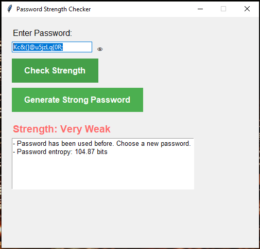

# Password Strength Checker

A Python-based desktop application to check the strength of passwords. This tool evaluates passwords based on length, complexity, and uniqueness, providing real-time feedback and suggestions for improvement. It also includes a password generator for creating strong, secure passwords.

 <!-- Add a screenshot of your application here -->

---

## Features

- **Password Strength Evaluation**:
  - Checks password length, uppercase/lowercase letters, numbers, and special characters.
  - Provides a strength rating (Very Weak, Weak, Moderate, Strong, Very Strong).
  - Calculates password entropy for a quantitative measure of strength.

- **Real-Time Feedback**:
  - Updates password strength and feedback as you type.

- **Password Generator**:
  - Generates strong, random passwords with a mix of uppercase, lowercase, numbers, and special characters.

- **Show/Hide Password**:
  - Toggle password visibility for easier input and verification.

- **Common Password Check**:
  - Warns if the password is too common or has been used before.

- **User-Friendly Interface**:
  - Clean, modern design with color-coded strength indicators.

---

## Requirements

- Python 3.x
- `tkinter` (included with Python)
- A list of common passwords (optional, provided in `common_passwords.txt`)

---

## Installation

1. **Clone the Repository**:
   ```bash
   git clone https://github.com/Philani56/python.git
   cd python
   ```

2. **Run the Application*:
   ```bash
   python main.py
   ```

3. **Optional: Add Common Passwords**:
```bash
Place a list of common passwords in a file named common_passwords.txt in the same
directory as the script. Each password should be on a new line.
```

---

## Usage
1. Enter a Password:
Type your password in the input field. The strength and feedback will update in real-time.

2. Generate a Strong Password:
Click the "Generate Strong Password" button to create a secure password.

3. Toggle Password Visibility:
Click the eye icon (👁️) to show or hide the password.

4. Check Password Strength:
Click the "Check Strength" button to see detailed feedback and suggestions.

---

## Contributing
### Contributions are welcome! If you'd like to improve this project, please follow these steps:

- Fork the repository.
- Create a new branch (git checkout -b feature/YourFeature).
- Commit your changes (git commit -m 'Add some feature').
- Push to the branch (git push origin feature/YourFeature).
- Open a pull request.

## License
- This project is licensed under the MIT License.

## Contact
- For questions or feedback, please reach out to khumalophilani580@gmail.com 


